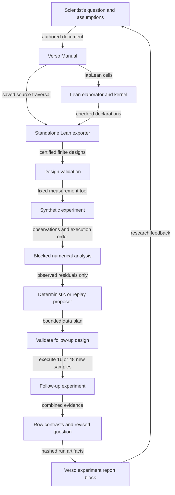

# Architecture

The notebook is an extension of `Verso.Genre.Manual`. Verso owns document parsing, Lean elaboration,
highlighting, proof-state hovers, document traversal, cross-references, and HTML generation.
This repository adds two code-block expanders and a small numerical research harness.

## Lean and Verso

`ResearchNotebook/Meta/Cells.lean` adapts the saved-code extension in Verso's official Apache-licensed
`DemoTextbook`. The `labLean` expander calls `InlineLean.lean`, so Lean elaborates the authored
cell normally. It wraps the resulting highlighted block in an extension carrying the original
source. The HTML implementation delegates to Verso's existing block renderer.

`NotebookMain.lean` traverses the document tree and collects these sources. Unlike a Markdown
regular-expression extractor, this pass reads the elaborated document structure. It writes one
fixed standalone module without recording the author's absolute file path. That module imports
Lean only, so the numerical design does not require Verso at execution time.

All four cyclic shifts are finite functions from row and column indices to a treatment. Balance and
coverage proofs use ordinary `decide`, whose result Lean's kernel reduces. The order theorem uses
`List.Perm.count_eq`. The additive contrast theorem computes the actual selected cells of shift 0
and proves the cancellation for arbitrary integer nuisance and treatment values using `omega`.

The exporter consumes a `CertifiedDesign` with row/column balance proof fields. Proofs are erased
when executing Lean, so the JSON is a data export rather than a portable proof certificate. The
harness first rebuilds the document, rechecks its extracted source, and inspects axiom dependencies.
Python then validates complete assignment tables and restricts proposals to the exported family.
The claim is tied to checked source and execution; arbitrary JSON labeled "proved" is insufficient.

## Numerical layer

`scripts/simulator.py` is an explicit synthetic measurement provider. It shuffles the actual cells
and verifies that execution is a permutation. Each observation records round, shift, trial, row,
column, treatment, and response. The seed and provider are recorded in the manifest.

`scripts/harness.py` contains the public data types, design/observation validation, numerical analysis,
and proposer interface. For balanced complete squares, the additive least-squares fit is:

`fitted = row mean + column mean + treatment mean − 2 × grand mean`.

The residual degrees of freedom are `N − 10`: one intercept and three parameters for each of the
three factors. The contrast standard error is `sqrt(2 × MSE / observations per treatment)`.
The runner uses Student-t quantiles for the supported 6, 22, and 54 degrees of freedom. These are
conditional model calculations, not probabilistic Lean theorems. Large residuals mark the intervals
as diagnostic only. The arbitrary residual threshold is a transparent demonstration rule.

If all four cyclic shifts have been observed, each row/treatment group contains all four columns.
Comparing treatment 3 with treatment 0 within a row then averages out column effects under the
assumed stable column model. A repeated single square cannot make this comparison without column
confounding, so the runner suppresses that interpretation on the replication path.

## Propose, validate, execute, observe, revise

`Proposer.propose(Analysis) → Proposal` is the optional adapter boundary. The deterministic provider
receives only the evidence hash, contrasts, residual diagnostics, and observation count. It cannot
receive simulator ground truth through this interface. It chooses one of two allowlisted plans:

- residual RMS above 0.9: complete coverage with shifts 1, 2, 3;
- otherwise: repeat shift 0 to check replication.

A replay provider accepts a human-written JSON proposal. Both paths verify the evidence hash, plan,
finite designs, explanatory fields, and the total sample budget. They do not accept code, commands,
model URLs, dynamic imports, or arbitrary tool calls. A future model adapter would propose the same
data structure and remain subject to validation; no model is needed in this prototype.

The revised question after execution follows observed row-contrast spread. It is recorded with an
unverified status, leaving judgment to the scientist rather than treating a threshold as a discovery.

## Provenance and invalidation

The manifest records SHA-256 hashes of the authored notebook, extension, driver, analysis/simulator
sources, Lean toolchain, Lake config, dependency lock, extracted code, design export, measurements,
summary, report, and proof audit. It also records versions, seed, provider, proof scope, and assumptions.
No timestamp or machine-specific path enters the report. `verify()` rehashes artifacts, recomputes
analysis from observations, and checks that the proposal was based on the initial observation hash.

The `experiment` extension reads the report at rendering time, avoiding stale Lean compilation
caches for numerical output. Before HTML generation, the notebook executable calls the verifier.
Changed source or artifacts require reproduction. Hashes establish consistency for this local
workflow; they are not signatures and do not defend against someone rewriting both source and
manifest. Git and independent CI supply the inspectable publication boundary.
